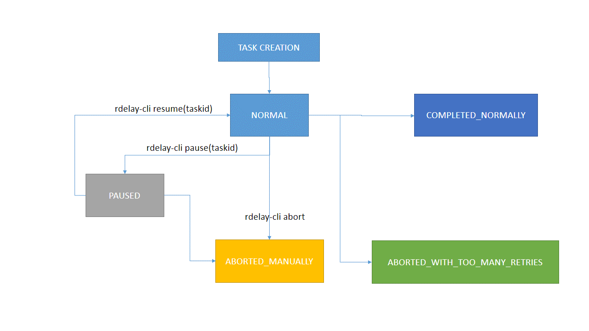
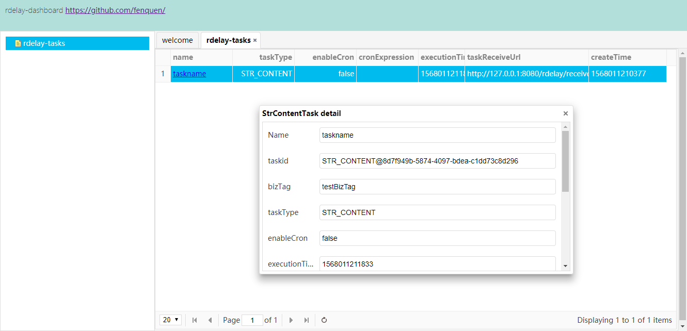

# rdelay[中文版](README_CH.md)
a redis-based lightweight distributable timing framework powered by spring boot,it is written in my spare time as an experimental work

### Theory
Use redis ZSET to maintain taskIds which are ordered by their execution time asc,get the tasks whose execution time is 
reached by now and then send them back to the url specified by each task respectively.It supports retry mechanism.


### Attention
The framework is now very primitive,there is much work ahead.Use it at your own risk.


### Rough structure


### Task lifecycle


### rdelay-dashboard
This optional component is used to collect statistics data such as tasks and task execution status,the data is displayed
by web ui.It uses mongodb to store statistics data.


### Usage
##### rdelay-cli

###### task creation(deliver text data) 
``````
 public static void sendTask() throws Exception {
         // designate the rdelay server address where the task to be sent
         RdelayCli.setDestSvrAddr("http://127.0.0.1:8086");
 
         //  while (true) {
         Req4CreateStrContentTask req4CreateStrContentTask = new Req4CreateStrContentTask();
 
         req4CreateStrContentTask.bizTag = "testBizTag";
         // run after 2s
         req4CreateStrContentTask.executionTime = System.currentTimeMillis() + 2000;
         req4CreateStrContentTask.executionAppSvrAddr = "http://127.0.0.1:8080";
         req4CreateStrContentTask.content = "testContent";
 
         Resp4CreateTask resp4CreateTask = RdelayCli.sendTask(req4CreateStrContentTask);
 
         System.out.println(resp4CreateTask.success + "_" + resp4CreateTask.errMsg);
 
         //  Thread.sleep(60000000);
         //  }
     }
``````
rdelay task also supports cron expression besides executionTime which can be triggered periodically
`````
public static void sendCronTask() throws Exception {
        // designate the rdelay server address where the task to be sent
        RdelayCli.setDestSvrAddr("http://127.0.0.1:8086");


        Req4CreateStrContentTask req4CreateStrContentTask = new Req4CreateStrContentTask();

        req4CreateStrContentTask.bizTag = "testBizTag";

        // enable cron
        req4CreateStrContentTask.enableCron = true;
        // when cron is enabled,"executionTime" will be ignored
        req4CreateStrContentTask.executionTime = System.currentTimeMillis() + 2000;
        // cron expression,executed per 2h
        req4CreateStrContentTask.cronExpression = "0/10 * * * * ? ";

        req4CreateStrContentTask.executionAppSvrAddr = "http://127.0.0.1:8080";
        req4CreateStrContentTask.content = "testContent";

        Resp4CreateTask resp4CreateTask = RdelayCli.sendTask(req4CreateStrContentTask);

        System.out.println(resp4CreateTask.success + "_" + resp4CreateTask.errMsg);

    }
``````
rdelay task also supports reflection invocation as long as use Req4CreateReflectionTask to create task
``````
 public static void sendReflectionTask() throws Exception {
        // designate the rdelay server address where the task to be sent
        RdelayCli.setDestSvrAddr("http://127.0.0.1:8086");

        Req4CreateReflectionTask req4CreateReflectionTask = new Req4CreateReflectionTask();

        req4CreateReflectionTask.bizTag = "testBizTag";

        // enable cron
        req4CreateReflectionTask.enableCron = true;
        // when cron is enabled,"executionTime" will be ignored
        req4CreateReflectionTask.executionTime = System.currentTimeMillis() + 2000;
        // cron expression,executed per 2h
        req4CreateReflectionTask.cronExpression = "0/10 * * * * ? ";

        req4CreateReflectionTask.executionAppSvrAddr = "http://127.0.0.1:8080";

        // necessary for reflection
        req4CreateReflectionTask.className = "com.a.d";
        req4CreateReflectionTask.methodName = "helloWorld";
        req4CreateReflectionTask.paramTypeNames = new String[]{"java.lang.String"};
        req4CreateReflectionTask.params = new String[]{"rdealy"};

        Resp4CreateTask resp4CreateTask = RdelayCli.sendTask(req4CreateReflectionTask);

        System.out.println(resp4CreateTask.success + "_" + resp4CreateTask.errMsg);
    }
``````
###### task lifecycle(pause,resume,abort)
``````
    public static void pauseTask() throws Exception {
        RespBase resp = RdelayCli.modifyTaskState(new Req4PauseTask("your taskid"));
        System.out.println(resp.success + "_" + resp.errMsg);
    }

    public static void resumeTask() throws Exception {
        RespBase resp = RdelayCli.modifyTaskState(new Req4ResumeTask("your taskid"));
        System.out.println(resp.success + "_" + resp.errMsg);
    }

    // the task is aborted, it can not be available any more
    public static void abortTaskManually() throws Exception {
        RespBase resp = RdelayCli.modifyTaskState(new Req4AbortTaskManually("your taskid"));
        System.out.println(resp.success + "_" + resp.errMsg);
    }
``````
#### rdelay-client-receiver(now only supports spring mvc controller)
please import rdelay-client-receiver.jar<br>
alternatively implements the interface StrContentTaskConsumer to process StrContentTask
```java
@Component
public class TaskConsumer implements StrContentTaskConsumer {
    @Override
    public void consumeTask(StrContentTask strContentTask) {
        System.out.println(strContentTask.content);
    }
}
```
