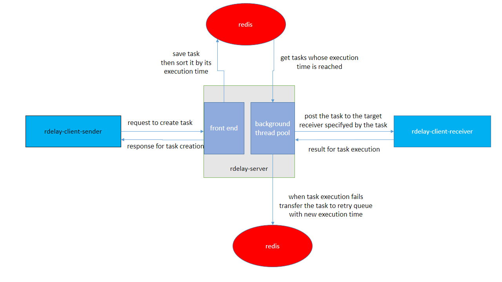

# rdelay
a redis-based lightweight distributable timing framework powered by spring boot as personal experimental work

### Theory
Use redis ZSET to maintain taskIds which are ordered by their execution time asc,get the tasks whose execution time is 
reached by now and then send them back to the url specified by each task respectively.It supports retry mechanism.


### Attention
The framework is now very primitive,there is much work ahead.Use it at your own risk.


### Rough structure



### Usage

#### sender 
```java
public class SenderExample {
    public static void main(String[] args) throws Exception {
        // designate the rdelay server address where the task to be sent
        TaskSender.setDestSvrAddr("http://127.0.0.1:8086");

      //  while (true) {
            Req4CreateStrContentTask req4CreateStrContentTask = new Req4CreateStrContentTask();

            req4CreateStrContentTask.bizTag = "testBizTag";
            
            // run after 2s
            req4CreateStrContentTask.executionTime = System.currentTimeMillis() + 2000;
            
            // the task where you want to be triggered
            req4CreateStrContentTask.executionAppSvrAddr = "http://127.0.0.1:8080";
            
            // the message you want to deliver
            req4CreateStrContentTask.content = "testContent";

            // send the request
            Resp4CreateTask resp4CreateTask = TaskSender.sendTask(req4CreateStrContentTask);

            // the request to creat the task is successful or not
            System.out.println(resp4CreateTask.success + "_" + resp4CreateTask.errMsg);

          //  Thread.sleep(60000000);
      //  }
    }
}
```
###### the task also supports cron expression besides executionTime which can be triggered periodically
```java
public class SenderExampleCron {
    public static void main(String[] args) throws Exception {
        // designate the rdelay server address where the task to be sent
        TaskSender.setDestSvrAddr("http://127.0.0.1:8086");

        Req4CreateStrContentTask req4CreateStrContentTask = new Req4CreateStrContentTask();

        req4CreateStrContentTask.bizTag = "testBizTag";

        // enable cron
        req4CreateStrContentTask.enableCron = true;
        // when cron is enabled,"executionTime" will be ignored
        req4CreateStrContentTask.executionTime = System.currentTimeMillis() + 2000;
        // cron expression,executed per 2
        req4CreateStrContentTask.cronExpression = "0/2 * * * * ? ";

        // the task where you want to be triggered
        req4CreateStrContentTask.executionAppSvrAddr = "http://127.0.0.1:8080";
        
        // the message you want to deliver
        req4CreateStrContentTask.content = "testContent";

        // send the request
        Resp4CreateTask resp4CreateTask = TaskSender.sendTask(req4CreateStrContentTask);

        // the request to creat the task is successful or not
        System.out.println(resp4CreateTask.success + "_" + resp4CreateTask.errMsg);

    }
}
```

#### receiver (spring mvc) 
###### alternatively implements the Interface "StrContentTaskConsumer" to process StrContentTask
```java
@Component
public class TaskConsumer implements StrContentTaskConsumer {
    @Override
    public void consumeTask(StrContentTask strContentTask) {
        System.out.println(strContentTask.content);
    }
}
```